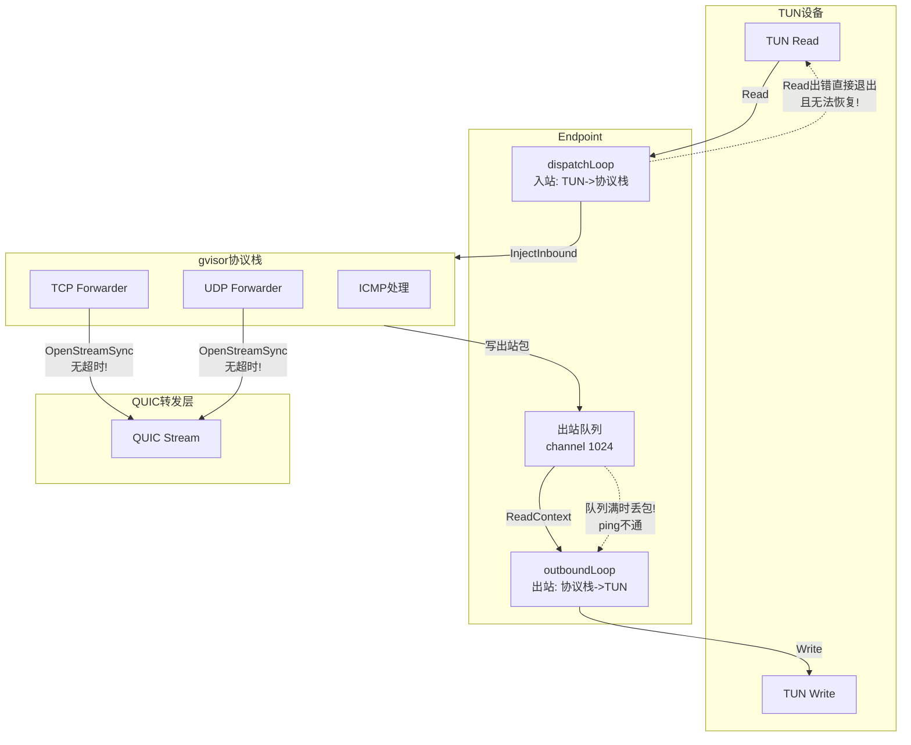

# 修复虚拟网卡运行一段时间后失效的问题

## 根因分析

通过代码审查，发现以下几个关键问题会导致虚拟网卡在运行一段时间后"假死"：

### 问题 1：channel.Endpoint 出站队列溢出导致丢包（最关键）

在 [endpoint_windows.go](netstack/endpoint_windows.go) 中：

```21:22:netstack/endpoint_windows.go
const (
	defaultOutQueueLen = 1 << 10
)
```

`channel.Endpoint` 内部使用一个固定长度（1024）的 channel 作为出站队列。当 `outboundLoop` 中的 `writePacket` 写入底层 TUN 设备变慢（例如系统负载高），或者 QUIC 连接异常导致大量回复包堆积时，这个队列会满。**一旦队列满，gvisor 协议栈向该 Endpoint 写入数据包会直接丢弃**，导致所有出站包（包括 ICMP Echo Reply）都被静默丢弃 —— 表现就是 ping 不通。

### 问题 2：dispatchLoop 静默退出，无恢复机制

```117:152:netstack/endpoint_windows.go
	for {
		n, err := e.rw.Read(data)
		if err != nil {
			break // 发生致命错误时退出循环
		}
		// ...
	}
```

`dispatchLoop` 在读取 TUN 设备出错时直接 `break` 退出，没有任何日志、重试或通知机制。一旦退出：

- 它会调用 `cancel()`，导致 `outboundLoop` 也一起退出
- 由于 `sync.Once`，这两个循环**永远不会被重新启动**
- 协议栈完全停止工作，虚拟网卡变成"僵尸"

### 问题 3：QUIC 连接失败时的级联故障

在 [forward_tcp.go](netstack/forward_tcp.go) 和 [forward_udp.go](netstack/forward_udp.go) 中：

```17:23:netstack/forward_tcp.go
func ForwardTCPConn(originConn *TcpConn, stun_quic_conn *quic.Conn) {
	new_quic_stream, err := stun_quic_conn.OpenStreamSync(context.Background())
	if err != nil {
		log.Println("打开quic流失败", err)
		originConn.Close()
		return
	}
```

`OpenStreamSync` 使用了 `context.Background()`，没有超时限制。当 QUIC 连接异常时，这个调用可能永久阻塞，每个新的 TCP/UDP 转发请求都会创建一个阻塞的 goroutine，造成 goroutine 泄漏和内存增长，最终拖垮整个协议栈。

### 问题 4：缓冲区复用竞争风险

```114:116:netstack/endpoint_windows.go
	offset, mtu := e.offset, int(e.mtu)
	data := make([]byte, offset+mtu)
	for {
```

`dispatchLoop` 中 `data` 缓冲区在循环外创建并复用，而 `InjectInbound` 内部通过 `buffer.MakeWithData` 对 data 进行了引用（不是拷贝）。如果 gvisor 的 PacketBuffer 在异步处理中仍持有旧数据引用，下一次 `Read` 会覆盖缓冲区，导致数据包损坏、校验和不匹配，进而被丢弃。

## 数据流示意




## 修复方案

### 修复 1：dispatchLoop 增加错误处理和重试机制

在 [endpoint_windows.go](netstack/endpoint_windows.go) 的 `dispatchLoop` 中：

- 临时性错误（如 `ErrWouldBlock`）应重试而非退出
- 添加日志记录，便于排查
- 每次循环为 `InjectInbound` 分配新的缓冲区（或在 Inject 之前拷贝），避免数据竞争

### 修复 2：增大出站队列并添加队列监控

- 将 `defaultOutQueueLen` 从 `1 << 10` (1024) 增大到 `1 << 14` (16384)
- 可选：定期记录队列使用情况

### 修复 3：QUIC 流操作添加超时控制

在 [forward_tcp.go](netstack/forward_tcp.go) 和 [forward_udp.go](netstack/forward_udp.go) 中：

- `OpenStreamSync` 使用带超时的 context（如 10 秒）
- 超时后及时清理连接资源

### 修复 4：dispatchLoop 中每次读取使用独立缓冲区

将 `data` 缓冲区的创建移回循环内部，或者在 `InjectInbound` 之前对数据进行拷贝，确保 PacketBuffer 持有的数据不会被后续读取覆盖。
