# 信令部分协议说明

## 状态说明
- **State=0**: 初始状态，Local端注册会话到Hash表
- **State=1**: Remote端认领后，发送Remote端地址
- **State=2**: Local端发送地址，开始建立P2P连接
- **State=3**: 连接成功
- **State=4**: 连接超时

## Redis存储结构
- **Hash表**: `{md5_tun_key}:sessions` - 存储待认领的会话（State=0）
- **独立Key**: `{md5_tun_key}:{sessionID}` - 存储已认领的会话数据（State>=1）

## 流程图

```mermaid
sequenceDiagram
    participant L as Local端
    participant R as Redis
    participant Re as Remote端

    Note over L,Re: 阶段1: 会话注册与认领

    L->>L: 生成SessionID
    L->>L: 创建RedisJsonType<br/>(State=0, LocalVersion)
    L->>L: 判断连接类型<br/>(主动/被动)
    
    alt 主动连接 (WanPort1==WanPort2)
        L->>L: 设置LocalAddr
    else 被动连接
        L->>L: LocalAddr为空
    end
    
    L->>R: RedisSessionRegister<br/>HSET {md5_tun_key}:sessions<br/>SessionID -> 加密数据
    Note right of R: Hash表存储<br/>State=0的会话
    
    L->>L: 等待Remote端认领<br/>(最多30秒)
    
    loop 每3秒扫描一次
        Re->>R: RedisSessionScan<br/>HGETALL {md5_tun_key}:sessions
        R-->>Re: 返回所有State=0的会话列表
        
        alt 找到待处理会话
            Re->>R: RedisSessionClaim<br/>Lua脚本原子操作<br/>HGET + HDEL
            R-->>Re: 返回会话数据
            
            Note over Re: 认领成功，从Hash中删除<br/>避免重复处理
            
            Re->>Re: 标记为正在处理<br/>(m_processing_sessions)
            Re->>Re: 启动processSession协程
        end
    end
    
    Re->>Re: 检查版本兼容性<br/>(LocalVersion vs RemoteVersion)
    
    alt 版本不兼容
        Re->>R: RedisSessionSet<br/>写入State=1(标记版本错误)
        Re->>Re: 返回，结束处理
    else 版本兼容
        Re->>Re: 获取UDP地址<br/>(GetUDPAddr)
        
        alt LocalAddr.WanPort1 == 0
            Note over Re: 被动连接模式<br/>(conn_type=0)
            Re->>Re: 创建TunActive
        else LocalAddr.WanPort1 != 0
            Note over Re: 主动连接模式<br/>(conn_type=1)
            Re->>Re: 创建TunPassive<br/>并启动
        end
        
        Re->>Re: 设置RemoteAddr
        Re->>Re: State = 1
        Re->>R: RedisSessionSet<br/>SET {md5_tun_key}:{sessionID}
        Note right of R: 写入独立session key<br/>通知Local端已认领
    end
    
    L->>R: RedisSessionGet<br/>GET {md5_tun_key}:{sessionID}
    R-->>L: 返回会话数据(State=1)
    
    alt 30秒内未被认领
        L->>R: RedisSessionUnregister<br/>HDEL {md5_tun_key}:sessions
        L->>L: 返回失败
    end

    Note over L,Re: 阶段2: 地址交换与连接建立

    L->>L: 检查版本兼容性<br/>(RemoteVersion vs LocalVersion)
    
    alt 版本不兼容
        L->>R: RedisSessionDel
        L->>L: 返回错误
    else 版本兼容
        L->>L: 收到RemoteAddr
        
        alt 被动连接 (conn_type=0)
            L->>L: 创建TunPassive
            L->>L: 设置LocalAddr
            L->>L: State = 2
            L->>R: RedisSessionSet<br/>更新State=2
        else 主动连接 (conn_type=1)
            L->>L: 创建TunActive
            L->>L: State = 2
            L->>R: RedisSessionSet<br/>更新State=2
        end
    end
    
    loop 每秒轮询
        Re->>R: RedisSessionGet<br/>GET {md5_tun_key}:{sessionID}
        R-->>Re: 返回会话数据
        
        alt State == 2
            alt 被动连接模式
                Re->>Re: TunActive.Start()
            else 主动连接模式
                Re->>Re: 等待连接建立
            end
            
            Re->>Re: 等待连接结果<br/>(select on tun_active_chain<br/>or tun_passive_chain)
            
            alt 连接成功
                Re->>Re: State = 3
                Re->>R: RedisSessionSet<br/>更新State=3
                Re->>Re: 启动代理服务<br/>handleConnection()
            else 连接超时
                Re->>Re: State = 4
                Re->>R: RedisSessionSet<br/>更新State=4
            end
        end
    end
    
    L->>R: RedisSessionGet<br/>GET {md5_tun_key}:{sessionID}
    R-->>L: 返回State=3或4
    
    alt State == 3
        L->>L: 连接成功<br/>返回QuicConn
        Note over L: 设置转发器<br/>开始数据传输
    else State == 4
        L->>L: 连接超时<br/>返回失败
    end
```

## 关键操作说明

### Local端关键操作
1. **RedisSessionRegister**: 使用HSET将会话注册到Hash表，等待Remote端认领
2. **RedisSessionGet**: 检查独立的session key是否存在，判断是否被认领
3. **RedisSessionSet**: 更新会话状态和地址信息
4. **RedisSessionUnregister**: 超时后从Hash表中移除注册

### Remote端关键操作
1. **RedisSessionScan**: 扫描Hash表，获取所有State=0的待处理会话
2. **RedisSessionClaim**: 使用Lua脚本原子地认领会话（HGET+HDEL），确保只有一个Worker能认领
3. **RedisSessionSet**: 写入独立的session key，通知Local端已认领
4. **RedisSessionGet**: 轮询获取会话状态更新

### 连接类型判断
- **主动连接** (conn_type=1): `LocalAddr.WanPort1 == LocalAddr.WanPort2` 或 `LocalAddr.WanPort1 != 0`
  - Local端创建TunActive
  - Remote端创建TunPassive
- **被动连接** (conn_type=0): `LocalAddr.WanPort1 == 0`
  - Local端创建TunPassive
  - Remote端创建TunActive

### 安全机制
1. **数据加密**: 所有Redis数据使用AES加密（go2aes.Encrypt7/Decrypt7）
2. **原子认领**: 使用Lua脚本确保会话只被一个Remote端认领
3. **版本检查**: 两端版本必须一致才能继续连接
4. **超时机制**: 各阶段都有超时保护，避免资源泄露
5. **状态验证**: 检查状态回退和异常跳转
